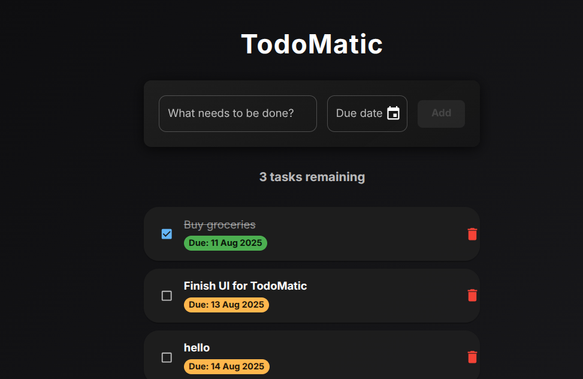

# TodoMatic

A modern, responsive, and accessible **Todo** application built with **React**, **Material-UI (MUI)**, **Dayjs**, **Framer Motion**, and **Lottie** animations.

---

## Demo Screenshot

  

---

## Features

- **Dark Mode Theme:** Beautiful custom dark theme with glassmorphic styling and smooth transitions.
- **Add Tasks:** Enter task description with an optional due date using a date picker.
- **Task List:** Displays tasks sorted by due date (tasks without dates appear last).
- **Mark Completed:** Toggle task completion with a checkbox.
- **Delete Tasks:** Remove unwanted tasks easily.
- **Overdue Highlighting:** Tasks overdue and not completed are visually highlighted.
- **Confetti Animation:** Celebrate task completion with a fun confetti animation using Lottie.
- **Responsive Layout:** Mobile-first design that adapts elegantly to all screen sizes.
- **Accessible:** Keyboard-friendly interactions and ARIA labels for screen readers.
- **Smooth Animations:** Adding, toggling, and removing tasks feature subtle animations powered by Framer Motion.

---

## Tech Stack

- **React** — Frontend library for building UI components
- **Material-UI (MUI)** — UI component framework for React
- **@mui/x-date-pickers** — DatePicker component with Dayjs adapter
- **Dayjs** — Lightweight date utility library
- **Framer Motion** — Declarative animations and gestures for React
- **Lottie React** — Render animations exported as JSON from Adobe After Effects (via Lottie)
- **TypeScript** — Type-safe JavaScript superset

---

## Getting Started

### Prerequisites

- Node.js (v14+ recommended)
- npm or yarn package manager

### Installation

1. Clone the repository:

```bash
git clone https://github.com/Reddy200307/React_projects/tree/main/to-do-list-swipeable
cd to-do-list-swipeable


2. Install dependencies:

```bash
npm install
# or
yarn install
```

3. Start the development server:

```bash
npm start
# or
yarn start
```

4. Open [http://localhost:3000](http://localhost:3000) to view the app in the browser.

---

## Usage

* Enter a task description in the input field.
* (Optional) Select a due date using the date picker.
* Click **Add** or press **Enter** (depending on device and focus) to add the task.
* Click the checkbox to mark a task as completed; a confetti animation plays on completion.
* Click the delete icon to remove a task.
* Overdue tasks are highlighted in red; completed tasks appear with a strikethrough and muted color.

---

## Folder Structure

```
src/
├── assets/
│   ├── confetti.json         # Lottie animation file
│   └── lottie.css            # Styles for Lottie container
├── components/
│   └── ToDo.tsx              # Main Todo component (your code)
├── App.tsx                   # Root app file
├── index.tsx                 # Entry point
└── ...
```

---

## Customization

* **Theme:** Modify the `darkTheme` object to change colors, typography, or component styles.
* **Animations:** Replace or customize the Lottie animation by swapping `confetti.json`.
* **Persistence:** Add localStorage or backend integration to save tasks between sessions.
* **Features:** Consider adding task editing, filtering, or drag-and-drop reordering.

---

## Accessibility

* All interactive elements have appropriate ARIA labels.
* Keyboard navigation is supported with focus management.
* Color contrast meets WCAG guidelines for dark mode.

---

## Dependencies

| Package             | Version |
| ------------------- | ------- |
| react               | ^18.x   |
| @mui/material       | ^5.x    |
| @mui/x-date-pickers | ^5.x    |
| dayjs               | ^1.x    |
| framer-motion       | ^7.x    |
| lottie-react        | ^2.x    |
| @mui/icons-material | ^5.x    |
| typescript          | ^4.x    |

---

---

---

## Acknowledgements

* [Material-UI](https://mui.com/)
* [Framer Motion](https://www.framer.com/motion/)
* [Lottie](https://airbnb.io/lottie/)
* [Dayjs](https://day.js.org/)

```

